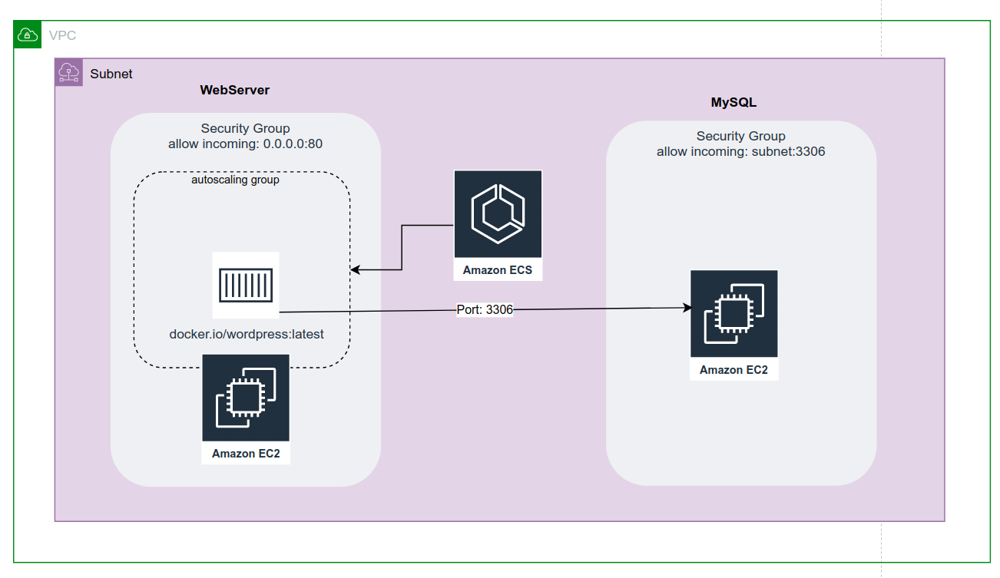

# Terraform / Ansible / Packer / Docker test



## Overview

The basic solution composed fromHow would you have done things to have the best HA/automated architecture ? web server tier and db tier deployed within the same subnet and VPC. The webserver tier based on docker container running EC2 instances and conducted by ECS AWS cluster service. The container image is taken from Wordpress official docker.io repository. The db tier is made from EC2 instance running mysql DB -> created AMI image with help of Packer and Ansible. 

Here I was not building my own docker image as was not certain of demand coming from your side. 

## Installation

1. As first Packer should be executed in order to generate mysql AMI image and put into repository.  The AWS credentials and region variables shall be updated accordingly. Prerequisites Ansible installed locally.

   ```
   packer build ./packer/ami/builder.json
   ```


2. As the second step the Terraform shall be fired up. The script uses default AWS profile and eu-west-3 region, this might need the modification before execution.  Created with Terraform v0.14.7

   ```
   cd ./terraform && terraform init
   terraform <plan|apply>
   ```

   
   It will deploy the infrastructure toghether with the ECS cluster/task/container definiton.

## Q&A

### 1. What was done?

It this question is pretty much covered by the bullets above.

### 2. How did you run your project?

I've prepared the development environment on my desktop PC with docker-compose. Next created the infra on AWS. Beside the VPS and subnet the EC2 db tier was the first I've stared playing with. On top of the default Ubuntu 20 server AMI , the mysql server was installed via ssh. As next the Packer-Ansible automation was created. Then going forward with deployment of AMI at cloud via Terraform; next creating the ECS service by console and than by Terraform.

### 3. What are the components interacting with each other ?

There is the containerized service running on top of EC2 connecting with DB server via mysql port. There is the auto-scaling group managed by the ECS, which spawns the containers in case of need. In my case it's actually set to 1. Wordpress containers and Mysql are residing in same subnet, but have the different security groups set. So the mysql do not have the public IP address and cannot be reached outside of defined subnet. 

### 4. What problems did you encounter?

How would you have done things to have the best HA/automated architecture ?Issues with connectivity - defined container ports with 8080 by mistake and need to check entire service why it's not working starting from targeting mysql box with mysql-client, reading the docker logs, ect. Beside needed to 

### 5. How would you have done things to have the best HA/automated architecture ? & Share with us any ideas you have in mind to improve this kind of infrastructure.

At for first DB should is the single point of failure here. Thus I would probably try one of the AWS RDS services for start to see if handling the DB tier on my own on does make any sense at all. The second option is to add EC2 instances - ( in different AZ ) and try install into cluster mode.

Regarding the web-service side, ECS can run more than 1 replicas so here, the change should be made as well as in autoscaling. On the from some LB or WAF preferably shall be deployed. In this way the traffic will be balanced between the containers and those will be deployed according to load.

Share with us any ideas you have in mind to improve this kind of infrastructure. 

### 5. Tomorrow we want to put this project in production. What would be your advice and choices to achieve that ? Regarding the infrastructure itself and also external services like the monitoring, … etc.

Generally the project is still far from production, the security is rather week - need to put the db credentials in the secrets, same for the IaC side, need to involve the Ansible vault to not leave the track of credentials at SCM behind. I also didn't check all the docker options having in mind the firing up the thing ASAP. 

But first of all it would be nice to test the solution against the real load which is greater than one request per minute to see how the system scales. The monitoring shall be added, either the AWS build in solution or Prometheus for container side etc. The external access should be hardened against the different types of common Wordpress attacks. including DDoS - maybe cloudFrond? The DB updated - different solutions like AWS Aurora could be something to consider. Depending on the content some cashing mechanism could be implemented (CDN). Backup mechanism shall be put in place if not already hosted by cloud provider. etc etc.
